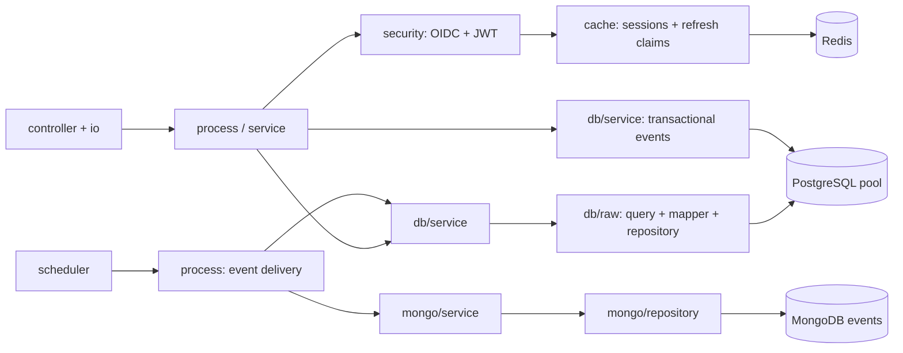

# Backend scaffold plan — 4 October 2026

## Decision

Use a resource-first TypeScript modular monolith with Fastify and explicit constructor injection. This supersedes the earlier NestJS/opaque-session proposal. Business domains group files within layers; they are not top-level deployment units.

| Approach                    | Trade-off                                                                                                 | Decision            |
| --------------------------- | --------------------------------------------------------------------------------------------------------- | ------------------- |
| NestJS modules              | Built-in conventions, decorators and container; less direct fit for your explicit wiring style            | Previously proposed |
| Fastify + composition root  | Small runtime, explicit dependencies and strong transport schemas; boundaries must be enforced by tooling | Selected            |
| Express + manual middleware | Familiar but more assembly for request schemas, lifecycle and serialization                               | Not selected        |

## Dependency structure

`container.ts` constructs one PostgreSQL pool, Redis connection and (worker only) MongoClient per process. Explicit startup checks, bounded pools/timeouts, rollback/release and graceful shutdown own their lifecycle. No request creates a connection pool. Scale-out multiplies each configured pool limit; budget connections across replicas.

## Authentication

> **Superseded on 7 October 2026.** The external-provider design below was replaced by the application's own sign-in. The current design, and the reasons for the change, are in [authentication.md](authentication.md). This section is kept as the record of the earlier decision.

Provider-neutral OAuth/OIDC was confirmed by the user. An external authorization server issues JWT access tokens and refresh tokens. Use Authorization Code + S256 PKCE, state, nonce, discovery and JWKS verification. No password grant or home-grown token issuer. Validate signature, allowed algorithm, issuer, API audience, subject, expiration and configured API scope. Identity alone does not create or upgrade local accounts.

The API acts as a confidential OAuth client. Store refresh tokens encrypted in Redis, bound to tenant, subject and a random browser session. The HttpOnly cookie contains only a random session identifier. Return access tokens in JSON for memory-only frontend use; never redirect with tokens in a URL. Protected routes require a Bearer JWT and a matching active session record, then re-read the tenant-local account/role. This permits immediate local logout and prevents a token established on one agency being replayed at another.

Serialize refreshes with an atomic Redis claim and compare-and-set finalization. Require refresh rotation; a failed/ambiguous refresh invalidates the local session and requires login. Logout during refresh must prevent session resurrection. Provider revocation is attempted separately; local invalidation is authoritative for this API. Browser refresh/logout require same-origin and CSRF headers. Session lifetime has an absolute cap, never sliding indefinitely.

Only explicit public routes bypass JWT: liveness/readiness, public tenant content and OAuth entry/callback/refresh/logout (the latter use their own session protections). All new routes default to protected. Providers must support JWT API audiences, PKCE, rotating refresh tokens and revocation. Phone OTP is a provider-specific onboarding feature to implement later.

## Durable event logging

PostgreSQL remains the business source of truth. Append a versioned, metadata-only event in the same tenant transaction as a crucial mutation. A separate worker leases outbox rows, upserts MongoDB by immutable event ID, and acknowledges only its current lease. Delivery is at least once; Mongo writes are idempotent. Retry with capped exponential backoff/jitter; exhaustions remain visible in PostgreSQL for investigation/replay. Mongo downtime must not roll back already committed business workflows. Never send passwords, tokens, contacts, biodata or arbitrary request bodies into events.

Start with login/refresh/logout audit events and an infrastructure event catalog for later approvals, interest acceptance and verified payment workflows. Existing 20 launch features remain an implementation backlog, not claimed complete by the scaffold.

## Implementation order and acceptance

1. Typed fail-fast config; tooling, dependency boundaries, lifecycle and migration runner.
2. Tenant-scoped pooled transactions, minimal runtime grants and real account/public reads against the existing schema.
3. OAuth/OIDC endpoints, JWT guard, atomic refresh sessions, role policy and safe transport errors.
4. PostgreSQL outbox, Mongo indexes/upserts and separately runnable delivery worker.
5. Unit/security/HTTP tests, real PostgreSQL/Redis/Mongo integration tests, build/lint/dependency checks and setup documentation.

Migrations are explicit operator commands, never API-startup side effects. Keep migration credentials separate from runtime. No payment/profile feature stubs or speculative MQ/replica adapters. Inject secrets through environment/secret-manager deployment integration; validate centrally and never log configuration values. Local dependencies may use Compose; production uses managed services, TLS, restricted credentials and backups.

## References

- [Fastify lifecycle](https://fastify.dev/docs/latest/Reference/Hooks/)
- [node-postgres pool](https://node-postgres.com/apis/pool)
- [openid-client](https://github.com/panva/openid-client)
- [OAuth security BCP](https://www.rfc-editor.org/rfc/rfc9700.html)
- [MongoDB connection pooling](https://www.mongodb.com/docs/drivers/node/current/connect/connection-options/connection-pools/)
