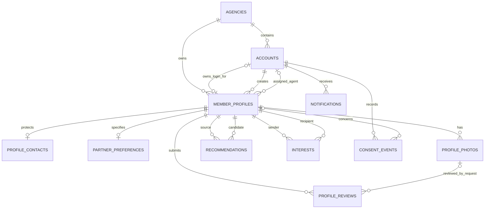
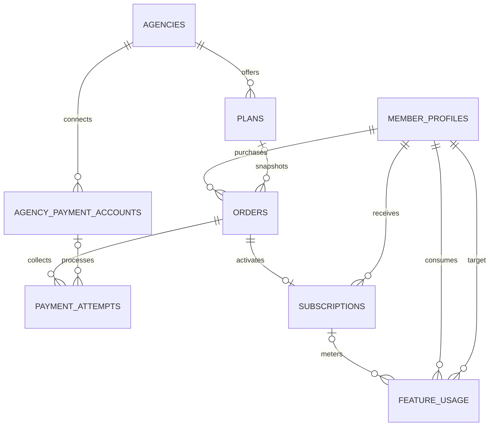

# Launch core entities and database design

Design baseline: 3 October 2026. Status: proposed design, not an applied application migration.

This design implements the supplied **Part 1 — Launch Set**, using the existing Lovable MVP as the starting point. The broader feature map supplies context, not additional month-one commitments. All 20 listed IDs are covered: 14 full-depth and 6 thin items. The labels “18 features” and “Thin (4)” do not match the enumerated list.

The user confirmed that negotiated assisted-service fees and self-service subscriptions coexist, that basic access is free, and that each agency receives payments through its own merchant account. There is no platform collection, settlement or agency SaaS billing model in this release.

## 1. Decisions and assumptions

**Use one PostgreSQL database, one shared schema and explicit agency ownership.** Implement MSBD as the first agency; add agencies by controlled provisioning, with no tenant-facing management screens.

| Approach | Benefit | Cost | Decision |
|---|---|---|---|
| Shared tables with agency keys | One deployment and migration path; simplest first launch | Isolation must be enforced at every boundary | Use now, with composite foreign keys and RLS |
| Schema per agency | Namespace separation | Migration and connection routing grow with tenant count | Defer |
| Database per agency | Strong operational separation; independent restore | Provisioning, pools, upgrades and support per tenant | Consider only for a future contractual requirement |

Cheap boundaries now are tenant-scoped identities, tenant-owned relationships, private media keys, payment-account separation and immutable purchase terms. Building every future entity is not required for multi-tenancy.

The SQL is in [launch-core-schema.sql](launch-core-schema.sql). It targets PostgreSQL 15+ and uses `btree_gist` for subscription-period exclusion. All operational table primary keys are `(agency_id, id)`; one-to-one children use `(agency_id, profile_id)`. UUIDs alone are not the tenant boundary.

Proposed launch defaults requiring product sign-off, not inferred contractual requirements:

- One member login manages at most one matrimonial profile inside an agency. A parent can be the account holder; the candidate remains the profile subject. Multiple guardians or siblings under one login are deferred.
- Account roles are `admin`, `agent`, `member`. `self_service`/`assisted` is a profile service mode, not a second identity or a separate permissions role. Both modes use the same pool. This deliberately refines the earlier AI suggestion of a fourth user type: changing service should not require recreating a person or account.
- Members submit changes to published biodata for approval in both modes. Before first submission, owners or staff can edit their draft. Admins approve new unassigned profiles; agents review assigned profiles.
- One current assigned agent per profile; no assignment-history entity or branch staffing model yet. New self-service registrations start unassigned. Assisted profiles may initially exist without a login, avoiding fake email accounts and shared passwords.
- Exactly three plans are seeded: one free default and two paid tiers. Names, prices, durations and numerical limits remain business inputs, not invented facts. The schema does not hardcode a maximum of three rows.
- The three entitlement controls are distinct full-profile views, distinct contact views and an advanced-search boolean. `0` denies a quota feature; `NULL` means unlimited; positive values are a cap. Basic search, interest and agent recommendations remain available to free members.
- Paid quota windows cover a purchased subscription term. Free quota windows are calendar months in the agency timezone. Revisiting the same target and feature within that window consumes no additional quota. Mid-term upgrades/proration are deferred; renewals can start at the current term's end.
- The five premium filters are height, income band, complexion, family status and district of origin. Basic filters retain age, religion, education, occupation, current location and marital status. These five are a proposed concrete selection.
- Accepted interest means mutual interest, not marriage or a completed service. Contact disclosure additionally requires target-owner consent and the viewer's entitlement. Interest alone does not automatically publish phone numbers.
- Public unauthenticated pages contain tenant content and pricing, not a browsable database of biodata. Authenticated search returns a deliberately limited preview projection.

## 2. Core entities

There are **17 tables**. Tables reflect records with different lifecycles or access rules, not additional product screens.

| Table | Responsibility | Important fields/relationships |
|---|---|---|
| `agencies` | Tenant and public branding | Unique hostname/slug, name, status, default locale/timezone, public configuration |
| `accounts` | Tenant-local actor/login identity | Role, normalized phone/email, verified phone time, external auth binding, status |
| `member_profiles` | Matrimonial subject and agency workflow | Owner, creator, assigned agent, service mode, lifecycle, content version, structured biodata |
| `profile_contacts` | Protected contact information | One per profile; contact name/relationship, phone, email, precise address |
| `partner_preferences` | Searchable preference inputs | One per profile; age/height ranges, coded religion/status/profession/location choices |
| `profile_photos` | Private media metadata and publication state | Profile, storage key, MIME/size, uploader, sort order, primary-photo flag |
| `profile_reviews` | Initial approval and subsequent edit/photo requests | Profile, kind, submitted payload/photo, base version, reviewer, decision/timestamps |
| `recommendations` | Agent-curated directional suggestions | Source/candidate, score snapshot/version/explanation, publication, member response, separate internal/public notes |
| `interests` | Member-to-member consent relationship | Sender/recipient, response, contact consent for each side; one unordered pair |
| `plans` | Editable tenant product catalog | Localized name/description, price, duration, three entitlement controls, default/active flags |
| `agency_payment_accounts` | Tenant-owned bKash connection | Provider, environment, merchant reference and secret-manager reference |
| `orders` | Agreed obligation and purchased terms | Profile, subscription/assisted kind, amount, optional upfront amount, immutable entitlement snapshot |
| `payment_attempts` | Payment attempts and confirmed receipts | Order, method, amount, provider IDs, idempotency key, confirmation/status, manual recorder |
| `subscriptions` | Time-bounded paid access | Profile/order, start/end, optional revocation; no overlapping valid periods |
| `feature_usage` | Distinct target consumption per quota window | Viewer, target, feature, subscription or free window, environment |
| `notifications` | Thin localized inbox | Recipient, deduplication event key, template key/version and safe payload; no read state |
| `consent_events` | Recorded registration/representation decisions | Actor/profile, purpose, document version, acceptance or withdrawal |

The schema intentionally has no `matches` table. A current accepted interest is the source of truth for a mutual match. Nor does it persist algorithm suggestions as thousands of candidate pairs; suggestions are computed, while an agent's published recommendation is durable.

### Biodata structure

Keep the fixed, single-valued biodata fields on `member_profiles` rather than splitting each form section into a separate entity:

- Personal: name, DOB, gender, marital status, height, weight, complexion, blood group, nationality.
- Location: city, current district/division, district of origin. Precise address is in `profile_contacts`.
- Education/work: highest degree, institution, subject, graduation year, occupation, job/employer, income band.
- Family/lifestyle: parents and their occupations, siblings count, family status, religion/sect/practice, diet, hobbies, about text.
- Operations: owner, creator, assigned agent, mode, lifecycle, version and timestamps.

Use stable codes for categories and Bangladesh locations; localize labels in the application. Validate against versioned application dictionaries, including district/division relationships and education/income ordering. The reference DDL does not seed or invent those dictionaries. Free-form names and descriptions retain the user's Unicode text; do not require duplicate Bengali and English biodata. Catalog/page copy can have both locales. Do not store age or a completeness percentage when they can be derived.

Date-of-birth, required approval fields, category values and min/max categorical ordering need boundary validation. Search uses DOB ranges rather than a stored age. This design does not attempt to decide legal eligibility rules from the supplied AI-generated market document.

### Tenant content

`agencies.public_config` is strictly non-secret, schema-validated configuration: logo/media references, colors, Bengali/English page copy, contact information, three branch entries with addresses/map coordinates, and six success-story entries. It is edited through provisioning/configuration, not a CMS. There is no operational branch entity, because assigning staff and reporting by branch are out of scope.

### Authentication boundary

`accounts` contains no OTP code, password or session token. The selected authentication implementation owns challenges, delivery, expiry, attempt limits, replay protection, passwords and sessions. `auth_issuer + auth_subject` bind a verified identity to an agency-local account; `phone_verified_at` is updated only after trusted verification. OTP registration is not complete merely because this table exists.

Phone normalization uses E.164; email normalization uses lowercase/trim. Uniqueness is tenant-local. The same phone/email may have separate memberships and biodata in two agencies, with no cross-agency permissions. A shared external identity may bind to both local accounts, but each request must select and verify exactly one tenant/account. Independent credentials per agency would require an auth provider with tenant namespaces or a tenant-aware auth service.

Do not assume adding `agency_id` to application tables changes a managed auth provider's email/phone uniqueness rules. The exact auth adapter is a next-step decision. If using Supabase, expose this domain through the backend; do not reuse the existing broad direct-browser database writes. Platform operators provision tenants through a separate privileged operational path, not an `admin` role that bypasses tenant boundaries.

## 3. ERD

All relationships below also carry `agency_id`. The first diagram shows the central domain; the second expands money and entitlement records. Optional ownership permits an agent to register a client before login activation.

FK details, nullability, unique constraints and every column are in the SQL. Creator/reviewer/account links are omitted from some diagram edges for legibility, not from the schema.

## 4. Lifecycles and transactional rules

### Registration and approval

1. Resolve the agency from an allowlisted hostname. Verify phone OTP using the chosen authentication implementation.
2. Bind/create that tenant's account; record accepted terms/privacy versions and, for family management, representation consent. Never treat staff-created biodata as evidence the candidate personally accepted terms.
3. Create draft profile, contact and preference rows together. No payment is required for registration or basic access. An agent-created profile can await account claiming through verified contact information and authorized agency review.
4. Submission captures an immutable review payload and `base_profile_version`; move a new profile to `pending_review`. For an existing active profile, preserve the currently approved content while a field update awaits review.
5. An authorized reviewer locks the request and profile, verifies the pending state and expected version, validates allowlisted typed fields, applies all relevant profile/contact/preference changes, records the decision and inserts the notification in one transaction. Stale revisions must be resubmitted/reviewed; never overwrite newer content silently.
6. New profiles become `active` on approval or `rejected` on rejection. Rejected profiles can return to draft for resubmission. Pausing, closing or matching removes the profile from normal discovery.

Contacts/preferences edits must bump the parent profile version as part of the same transaction; the profile-row trigger alone cannot detect edits to its child tables. Member submissions cannot set role, agent assignment, service mode, approval state or financial fields.

Photos use private immutable object keys such as `{agency_id}/{profile_id}/{photo_id}.webp`. Upload and validate first, then create a staged photo and review request. Publish by changing database metadata after approval, avoiding a required cross-bucket move. Rejected/cancelled or removed files remain inaccessible and can be garbage-collected. Enforce the 10-photo cap under the profile lock, including pending additions. Serve short-lived signed URLs only after the same visibility checks as profile access. MIME declarations alone are insufficient; verify decoded file content. Never delete the current primary photo before a replacement is usable.

### Recommendations versus interests

Compute suggestions only from active, approved, same-agency candidates. Use deterministic preference scoring with a named version and human-readable explanation; labels such as high/moderate compatibility are presentation rules, not an independent database truth. Missing data must not inflate compatibility. Store scores/explanations and both content versions when an agent saves a recommendation; refresh or label the snapshot if either profile changes. Do not claim machine learning in month one.

Recommendations are directional: recommending B to A does not notify B or imply either person's consent. Only published, non-withdrawn recommendations appear to A. `internal_note` is never in the member projection. An owner responding Interested can initiate the corresponding interest in the same transaction; Declined changes only that recommendation response. Agents cannot impersonate a member's acceptance or grant contact consent.

An interest has one canonical unordered pair. A sends; B explicitly accepts or declines. If B expresses interest in A while A's request is pending, the operation accepts the existing pair instead of creating a reverse duplicate. The unique pair index plus row locking resolves simultaneous opposite requests. Declined/withdrawn relationships cannot be resent in this launch policy; future reopening/history can be added deliberately.

An accepted interest produces the mutual-match notification to both owners. Contact release is directional: to view B's contact, A needs an accepted relationship, B's current contact-sharing consent and A's plan quota. Consent can be withdrawn without pretending that a prior disclosure never occurred. Sensitive fields are reauthorized on every read; `feature_usage` is not a permanent permission grant. The full two-stage biodata/contact request workflow from the broad feature map is deferred.

### Orders, payments and subscriptions

An order records what is owed; a payment attempt records what was attempted/received; a subscription records the resulting access period. These are intentionally separate lifecycles.

- A subscription order snapshots the selected plan name/description, price, duration and all three entitlements. Subsequent admin plan edits affect future purchases, not old orders or current paid access. The free plan is a fallback, not a fabricated zero-value payment/order.
- An assisted order snapshots the negotiated total and optional upfront obligation. Each upfront/final/other receipt is a separate successful payment row. This replaces the prototype's single mutable upfront/final summary. An assisted fee does not silently buy self-service premium entitlements; an explicit subscription purchase can coexist if required.
- Store money as integer minor units (`100` = BDT 1), not floating point. Outstanding balance is order total minus the sum of confirmed successful payments. `pending`/`partial`/`paid` is derived; never subtract only the upfront amount.
- Each bKash attempt references that agency's merchant connection and sandbox/live environment. Store only the secret-manager reference in the database. Merchant credentials, grants/access tokens, OTPs and raw sensitive gateway responses do not belong in public config or notification payloads.
- Insert the attempt and idempotency key before calling the gateway. Store the provider payment ID after creation. Do not mark success from browser return parameters. Verify the provider result server-side, including merchant context, reference, amount and currency. An ambiguous result stays `unknown`; reconcile it before enabling another checkout. Do not hold a database transaction open across a gateway call.
- On verified completion, lock the order/profile, confirm the attempt once, ensure the order is a payable subscription order and fully paid, create at most one subscription for that order, and insert its notification in one transaction. Duplicate completion requests return the prior result. Unique provider transaction IDs prevent crediting one transaction twice within a merchant connection. Merchant references must not be duplicated under new IDs to bypass this constraint.
- Manual receipts require admin/assigned-agent authorization, a recorder and a retry idempotency key. Serialize all collections against the order and reject collecting more than outstanding. Do not enter a manual receipt while an unresolved online checkout might still settle. Confirmed receipts and order snapshots are immutable through the application API; refunds/reversals require a separate future model rather than editing history.
- Subscription activation must reject assisted-service orders, insufficient payment and cancellation. Those cross-table business conditions need the controlled transaction, not a row `CHECK`. Enforce server-authoritative snapshot creation and payment state transitions there too.
- Schedule renewal after the latest non-revoked term under a profile lock. An exclusion constraint additionally prevents overlapping periods. Effective access is computed from `starts_at <= now() < ends_at` and no revocation; it does not depend on an expiry job running on time.
- Sandbox and live orders/payments/subscriptions are distinct. The sandbox demo runtime can grant sandbox entitlements; production authorizes only live entitlements. Sandbox receipts must never count as real revenue. No auto-renewal mandates, settlement accounts or provider callback assumptions are added merely because checkout is called tokenized.

### Entitlement consumption

For a full-profile or contact read, lock the viewer profile; resolve its current subscription in the trusted runtime environment or the default free plan; calculate the canonical window; authorize the target and consent; check for an existing distinct-target usage row; compare count to cap; insert usage and return the permitted projection. All quota-consuming paths use this transaction. Two simultaneous requests with one remaining slot cannot both pass.

For free access, compute month boundaries in the agency timezone and persist UTC timestamps. For paid access, use exact subscription boundaries. Never accept window timestamps, plan choice, snapshot values or tenant IDs directly from the browser. Paid plan changes apply next purchase; free-default changes apply immediately. A repeat view skips quota consumption, but never skips current authorization.

Advanced search is a boolean entitlement with server-side filter validation, not an extra search table or usage event. Hiding filters in the UI is insufficient. Staff searches of the agency's pool use explicit staff permissions and do not consume a member's allowance. Agent recommendations can show their curated approved profile projection without a paid full-profile-view quota; they do not bypass contact consent.

## 5. Tenant and privacy enforcement

Tenant isolation has three layers:

1. Trusted hostname resolution and a tenant-bound authenticated account on every request/job.
2. Agency predicates in repository queries and tenant/profile-prefixed private storage keys.
3. Composite foreign keys plus PostgreSQL RLS as a second database boundary.

For example, `(agency_id, candidate_profile_id)` references `(agency_id, id)` on profiles. A valid UUID belonging to another agency still fails the foreign key. PostgreSQL supports composite foreign keys and constraints; these prevent invalid relationships rather than relying on every caller to remember a filter. [PostgreSQL constraints](https://www.postgresql.org/docs/15/ddl-constraints.html).

The reference SQL enables and forces tenant RLS on every domain table. The backend sets `app.agency_id` transaction-locally after trusted resolution, then executes all queries inside that transaction. An unset setting yields no rows. This setting is not an authentication credential; never let browsers choose it or issue SQL. Run the application as a non-owner role without `BYPASSRLS` or superuser privileges. Owners/bypass roles require particular care under PostgreSQL RLS. [PostgreSQL row security](https://www.postgresql.org/docs/15/ddl-rowsecurity.html).

Hostname lookup must bootstrap before the tenant setting exists. Use a tiny provisioning-owned resolver/cache that exposes only active hostname → agency ID/public configuration, or a narrowly audited resolver function. Do not grant a general tenant bypass to ordinary application code. Unknown/suspended hosts fail closed. Jobs, caches, signed media, rate-limit keys and logs also carry the verified agency context; validate proxy host headers.

**The SQL implements tenant isolation, not complete member/staff authorization.** Before live use, controlled backend operations and runtime grants must enforce: owner is a member; assigned agent/reviewer is allowed staff; members access only their own reviews/payments/inbox; agents edit only assigned clients; staff may search safe same-agency candidate projections; clients cannot read private contacts or internal notes directly. Do not grant the browser the backend role. Runtime grants are intentionally absent from the DDL until these operations are implemented.

Financial and review history is retained: the schema does not cascade-delete it. Closing a profile is an operational status, not erasure. Retention/anonymization and legal policy are later explicit decisions; the supplied feature-map legal claims are not independently validated here. `consent_events` records evidence, not a claim of complete regulatory compliance.

## 6. Feature-to-model coverage

| Launch ID | Implementation data |
|---|---|
| 1.1 Homepage | Agency public config and locale |
| 1.2 Registration/OTP | Auth implementation + accounts, profiles, contacts, preferences, consent events, initial review |
| 1.3 Pricing | Three tenant plans |
| 1.4 Success stories | Six public-config entries; no CMS |
| 1.5 About/contact | Three public-config branch entries and map coordinates |
| 2.1 My Profile/edit requests | Profiles, contacts, preferences, photos, reviews |
| 2.2 My Matches | Computed suggestions and agent recommendations with compatibility explanations |
| 2.3 Interest/mutual match | Interests; accepted pair is the mutual match |
| 2.4 Inbox | Notifications; no read/unread state |
| 2.5 Payment status | Orders, confirmed payments and subscriptions |
| 3.1 Basic search | Indexed active profiles; no search-history table |
| 3.2 Advanced search | Same profile query + advanced-search entitlement for five extra filters |
| 3.3 Detail/paywall | Safe preview/detail/contact projections + quota and consent checks |
| 4.1 Admin count cards | Queries over profiles, reviews and confirmed payments; no analytics store |
| 4.2 Approval queue | Profile reviews joined to assigned profiles; staged photos |
| 4.3 Agent clients | Accounts, profile assignment/mode, profiles and recommendations |
| 4.4 Plan management | Three seeded editable plan rows |
| 5.1 bKash sandbox | Agency payment account, order, payment attempts and subscription activation |
| 5.2 Manual payments | Assisted/subscription order and staff-recorded receipt |
| 5.3 Gating | Three plan/order snapshot fields, effective subscription, feature usage |

Dashboard definitions should be explicit: registrations = profiles created in a requested date range; pending = pending review rows (or distinct profiles, labeled accordingly); active = current active profiles; revenue = confirmed receipts in the chosen environment/date range. Revenue is neither order totals nor a plan-price sum.

No tables or screens are added for CMS, PDF biodata, identity verification, chat, WhatsApp/SMS campaigns, tasks/follow-ups, meeting scheduling, advanced analytics, Bengali search normalization, mobile apps, tenant self-onboarding or agency billing. The only SMS integration required here is OTP delivery. Notifications are in-app only.

## 7. Mapping the prototype to this design

| Existing model | Target change |
|---|---|
| `profiles` + `user_roles` | Tenant-local accounts with one launch role and verified auth binding |
| `client_profiles` | Member profiles + protected contacts; explicit ownership, mode, agency and version |
| `match_preferences` | Typed partner preferences; remove unused custom-weight/hard-filter JSON from launch |
| Storage folder listings | Photo metadata records and private agency/profile keys |
| `profile_change_requests` | Versioned profile reviews; explicit cancellation; photo IDs instead of arbitrary paths |
| `match_recommendations` | Recommendations for curation + interests for actual member consent |
| One `payments` summary per client | One assisted order plus individual confirmed receipts; subscriptions stay separate |
| No plan or tenant model | Agencies, plans, orders, subscriptions, scoped usage and merchant connection |

Migration must be a separate reviewed step. Provision MSBD and map every existing row to its tenant. Preserve original IDs where practical. Do not invent payment evidence: convert legacy upfront/final figures into confirmed receipts only after checking dates/status and reconciling with the agency. Quarantine ambiguous totals. Do not convert old `client_interested` recommendations into mutual interests without the other member's consent. Revalidate photo ownership/access before moving keys. Existing auth mappings require a provider-specific plan; this schema is not a direct replacement for Supabase migrations.

## 8. Validation and next design step

The reference DDL is intended to be checked in an isolated PostgreSQL database, not applied to existing project data. [schema-checks.sql](schema-checks.sql) exercises key database invariants and rolls back fixtures. See [validation.md](validation.md) for the actual run result and limits.

The next system-design step is the permission and transaction contract: who can perform each transition, which profile fields each projection exposes, how the selected OTP/auth system binds tenant accounts, and the exact payment-confirmation/entitlement operations. Finalize plan names/prices/limits, contact-sharing wording, filter selection and family-account cardinality before those APIs become contracts.

The bKash official sandbox demonstrates separate create/execute/query operations. The exact merchant-enabled API contract must be checked against supplied sandbox credentials/docs during integration; this schema does not assume an unsolicited webhook or recurring agreement. [bKash sandbox demo](https://merchantdemo.sandbox.bka.sh/tokenized-checkout/version/v1.2.0-beta).
