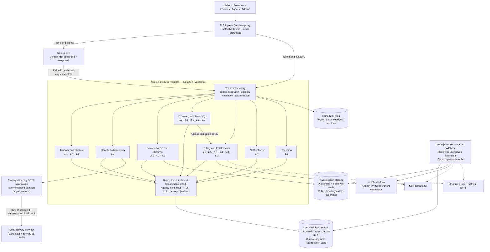

# Launch system design

> **Implementation update — 4 October 2026:** the [backend scaffold plan](backend-scaffold-plan.md) supersedes the NestJS and opaque-session choices below. The scaffold uses resource-first Fastify with explicit wiring, provider-issued JWT/OIDC tokens, Redis refresh sessions, and a PostgreSQL outbox delivered to MongoDB. The product workflows below remain the launch design.

Proposed architecture — 3 October 2026. Design only; no Node.js scaffolding or migration is included. Scope: all **20 launch features (14 full-depth, 6 thin)**. MSBD is the first isolated tenant. Free basic access, subscription purchases and negotiated assisted fees coexist; each agency uses its own bKash merchant account.

Read with [launch feature checklist](launch-features.md), [core entities and ERDs](core-entities.md) and [reference schema](launch-core-schema.sql). Earlier product defaults remain proposals unless explicitly confirmed.

## 1. Architecture decision

Build a **modular monolith**: one Node.js backend codebase, one synchronous API process and one background-worker process. Business modules call each other in-process and share PostgreSQL transactions. The worker uses the same application services and tenant rules.

| Option                       | Trade-off                                                                                       | Decision                                                             |
| ---------------------------- | ----------------------------------------------------------------------------------------------- | -------------------------------------------------------------------- |
| Next.js-only backend         | Fewer processes, but couples the frontend migration to backend operations and worker deployment | Viable, but less suitable for the separately planned Node.js backend |
| Modular Node.js API + worker | Clear module ownership, straightforward transactions, independently scalable runtime processes  | Recommended                                                          |
| Microservices                | Independent service ownership at the cost of distributed transactions and more operations       | Defer until measured scale or team ownership justifies extraction    |

Recommended implementation baseline: **TypeScript, NestJS with its Fastify adapter, versioned REST/OpenAPI, PostgreSQL with `pg` and SQL migrations**, plus managed Redis for app sessions and distributed rate limits. Next.js serves the Bengali-first frontend. Use private object storage, a managed identity provider and provider adapters for OTP and bKash. Nest's modules provide explicit exported interfaces; the Fastify adapter is an officially supported option. [Nest modules](https://docs.nestjs.com/modules), [Fastify adapter](https://docs.nestjs.com/techniques/performance).

Select exact supported package/runtime versions when scaffolding. Keep the existing SQL constraints/RLS authoritative; do not regenerate the schema from ORM models and silently lose them. Redis is not a financial ledger or quota authority.

## 2. System diagram

Solid arrows indicate request/data paths; dotted arrows indicate telemetry or restricted configuration access. Boxes within the API are modules, not microservices. Editable source: [system-design.mmd](system-design.mmd).



The API is the only domain-data entry point. The browser never receives database credentials, service-role keys or an unrestricted storage client. bKash browser navigation returns through the ingress to a dedicated confirmation route; that return is only a signal to verify, not proof of payment. Downloads may use short-lived signed URLs issued by the API after authorization.

## 3. Module responsibilities

| Module                      | Owns                                                                         | Contract                                                                                  |
| --------------------------- | ---------------------------------------------------------------------------- | ----------------------------------------------------------------------------------------- |
| Tenancy and Content         | Agencies, hostname resolver, public branding/page config                     | Resolve active host; expose only public config; seed tenants operationally                |
| Identity and Accounts       | Accounts, registration consent, identity adapter, app sessions               | Verify identity; bind tenant account; provision staff through authorized operations       |
| Profiles, Media and Reviews | Profiles, contacts, preferences, photos, approval requests, agent assignment | Own draft/edit/approve/publish workflows and privacy projections                          |
| Discovery and Matching      | Search, scoring, recommendations, interests                                  | Same-agency candidates; deterministic compatibility; explicit mutual consent              |
| Billing and Entitlements    | Plans, merchant connections, orders, attempts, subscriptions, usage          | Verified collection; immutable purchase terms; concurrent-safe access consumption         |
| Notifications               | Inbox entries and localized template catalog                                 | Append deduplicated notifications inside the originating transaction; list only own inbox |
| Reporting                   | Tenant-scoped read queries, no separate store                                | Registration/pending/active/confirmed-revenue counts                                      |

One application service owns a use-case transaction. Modules expose narrow methods accepting its transaction context; they do not start hidden nested transactions or write another module's tables through arbitrary SQL. Reporting may use explicit read projections across tables. Avoid a generic repository/framework abstraction that obscures authorization.

Suggested API groups: `/api/v1/public`, `/auth`, `/me/profile`, `/profiles`, `/matches`, `/interests`, `/notifications`, `/agent/clients`, `/reviews`, `/admin/staff`, `/admin/summary`, `/plans`, `/orders`, `/payments`. Route names and OpenAPI schemas are finalized when scaffolding; permissions attach to operations, not merely path prefixes.

## 4. Tenant, identity and authorization boundaries

1. **Ingress:** validate allowlisted agency hostname and remove spoofable forwarded tenant/host headers. Configure trusted proxies explicitly. Unknown/suspended hosts fail closed. `/api/v1` shares the site's origin; direct internal API access cannot supply arbitrary trusted host context.
2. **Tenant bootstrap:** use a narrow resolver backed by an operator-provisioned hostname map or audited lookup function. It returns agency ID/status/public config only. It does not give the application a general RLS-bypass role. Workers enumerate provisioned agency IDs through the same restricted operational configuration.
3. **Identity:** proposed default is managed Supabase Auth behind an `IdentityProvider` adapter, retaining a migration path from the prototype. It verifies phone OTPs and may retain existing staff email/password login. Local roles always come from `accounts`; signup never accepts a requested staff role. Supabase's Send SMS Hook can replace its built-in delivery with a selected gateway; verify available hosting-plan support and real Bangladesh delivery before committing to the provider. [Official SMS hook](https://supabase.com/docs/guides/auth/auth-hooks/send-sms-hook).
4. **Session:** after verification, issue a random opaque app-session cookie: host-only, Secure, HttpOnly, SameSite=Lax, no parent-domain cookie. Store its digest-bound tenant/account/identity/authentication-time record in Redis, with an initial proposed 12-hour absolute expiry. Rotate on login and revoke on logout. Re-read account/agency status and current role for protected requests; invalidating an external identity must also revoke its app sessions, which otherwise expire at the absolute cap. Use CSRF tokens plus Origin checks on cookie-authenticated mutations. Do not store browser tokens in localStorage.
5. **OTP abuse controls:** provider owns OTP secrets/verification. The backend binds challenge intent to phone, agency and purpose; rate-limit per IP, normalized-phone hash and agency, plus a platform-wide phone bucket. An SMS hook authenticates provider signatures and accepts only a matching, unexpired server-created send intent. This avoids bypassing delivery limits through a publicly callable auth endpoint. Do not trust tenant or role values from identity user metadata.
6. **Database:** acquire one pooled connection; begin; set agency using transaction-local `set_config`; authorize and execute all reads/writes; commit/rollback; release. Parameterize SQL. Never use independent pool queries inside this transaction. [node-postgres transaction requirements](https://node-postgres.com/features/transactions).

The same external identity may bind to separate tenant-local accounts, as allowed by the entity design; this does not grant cross-agency access. Independent credentials per agency require a tenant-aware identity provider and remain a separate decision. No tenant UI or platform-super-admin portal is introduced.

| Actor                 | Permitted launch access                                                                                                                        |
| --------------------- | ---------------------------------------------------------------------------------------------------------------------------------------------- |
| Visitor               | Tenant public pages, pricing, registration/login                                                                                               |
| Member/family account | Own profile/requests/payments/inbox; approved candidate projections within entitlement and consent rules                                       |
| Agent                 | Assigned clients/reviews/manual receipts; safe discovery of same-agency candidates; publish recommendations; cannot impersonate member consent |
| Agency admin          | Agency staff, assignment, profiles/reviews, plans, payments and count cards                                                                    |
| Worker                | Only controlled reconciliation/cleanup operations in an explicit agency context                                                                |

## 5. Critical request flows

**Registration → approval.** OTP establishes identity; an idempotent tenant-account transaction creates the account/profile/contacts/preferences and consent records. Retrying after an auth-provider success must recover the existing local account. Submission captures content/version. Reviewer locks request/profile, checks assignment/role and version, applies allowed changes, changes status and appends the inbox event atomically. Concurrent stale edits return a conflict. Active published content stays visible while replacement edits are pending.

**Discovery → mutual interest.** Query indexed approved/active profiles in the same agency, with bounded filters and cursor pagination. SQL narrows candidates before a versioned scoring function ranks a bounded candidate set. The API returns compatibility labels/explanations and safe previews. Agent recommendations are separate from user intent; accepting an interest creates the mutual relationship and both notifications atomically. The canonical pair uniqueness rule handles simultaneous opposite requests. Use consistent profile-ID ordering when locking multiple participants to reduce deadlocks.

**Paywall → disclosure.** Public/previews exclude contacts and internal notes. For quota-consuming detail/contact access use an explicit POST access operation, not a prefetched GET. Lock the viewer profile, resolve live/sandbox subscription or free plan, validate candidate visibility and directional consent, deduplicate target usage and consume quota before returning the authorized projection. Repeat access still rechecks permissions. Use private `no-store` responses; never cache this result in the shared CDN. Advanced-filter authorization happens server-side. The proposed three limits and five filters remain those listed in the entity design.

**Photo upload → publication.** For launch, bounded authenticated uploads go through the API media adapter: at most 5 MiB, verified JPEG/PNG/WebP, decoded dimension/pixel limits, normalized image and stripped metadata. Enforce profile ownership and total-photo cap under lock. Store under an immutable tenant/profile/photo key, then commit staged metadata/review; never publish before approval. DB failure after storage upload produces an inaccessible orphan, cleaned later with an age grace period and a final metadata check. Approval publishes metadata without a fragile file move. Short-lived signed media links bound the revocation delay; previously downloaded files cannot be recalled.

**Purchase → activation.** Prices and entitlements come from server snapshots, not browser values. Both API confirmation and worker reconciliation use the same Billing service and lease/transaction rules:

```mermaid
sequenceDiagram
    actor Member
    participant API as Node API
    participant DB as PostgreSQL
    participant BK as Agency bKash
    participant W as Reconciliation worker
    Member->>API: Buy plan with idempotency key
    API->>DB: Commit order snapshot and attempt
    API->>BK: Create checkout outside DB transaction
    BK-->>API: Payment ID and checkout URL
    API->>DB: Persist provider ID
    API-->>Member: Checkout URL
    Member->>BK: Authorize payment
    BK-->>Member: Return to site
    Member->>API: Confirmation signal with bound state
    API->>DB: Claim attempt with expiring lease
    API->>BK: Verify or execute using provider contract
    alt Verified completion
        API->>DB: Lock order/profile; confirm receipt; activate once; notify
        API-->>Member: Paid and access active
    else Ambiguous result or interrupted browser
        API->>DB: Preserve unresolved attempt and next check time
        API-->>Member: Payment being verified
        W->>DB: Claim due attempt with lease
        W->>BK: Query provider status
        W->>DB: Apply verified result through same Billing service
    end
```

Validate merchant/environment, payment reference, amount, currency and provider status server-side. Confirmation state is signed and bound to attempt/agency/environment/expiry; cookie presence is not required for provider returns. A valid signature cannot itself mark a payment paid. Do not assume bKash sends webhooks: confirm the provisioned API contract. Its official sandbox exposes execute/query operations. [bKash sandbox](https://merchantdemo.sandbox.bka.sh/tokenized-checkout/version/v1.2.0-beta).

Do not automatically retry ambiguous create/execute operations. Query by known provider ID; if checkout creation succeeded remotely but its ID was lost, use a documented provider recovery path or alert for manual reconciliation while the order remains blocked. Database uniqueness/idempotency prevents duplicate local credit, not all remote side effects. Manual collection is blocked while online settlement is unresolved. Sandbox transactions grant access only in the sandbox runtime and never count as live revenue.

## 6. Background work and schema follow-through

The inbox needs no queue: insert notifications in the same transaction as the business action. The UI fetches on navigation and may poll while visible. There are no read/unread states, sockets, SMS campaigns or external-notification pipeline.

The worker scans durable unresolved payment rows per agency and cleans aged orphaned media. Claims use short transactions with `FOR UPDATE SKIP LOCKED`, expiring leases and a fencing token; provider I/O runs after commit. A worker crash releases work through lease expiry. Finalization is conditional on its current lease token. Use bounded retries/backoff with jitter for retry-safe calls, alert exhausted attempts, and never drop unresolved financial state. Explicit database locks support these concurrency controls. [PostgreSQL locking](https://www.postgresql.org/docs/15/explicit-locking.html).

Before implementation, amend the proposed schema in a separate reviewed migration:

- Add payment reconciliation fields: `next_reconcile_at`, `lease_until`, `lease_token`, `reconcile_attempt_count`, `last_reconcile_error_code`, plus a due-work index. These are operational state on `payment_attempts`, not a new business entity or feature.
- Add `plan_name_snapshot` to `orders`; the previous design described that snapshot but DDL only included a generic description. Snapshot actual terms explicitly.
- Add `expires_at` to subscription checkout orders, and define provider-aware cancellation before replacing an outstanding checkout. Never expire an ambiguous potentially paid attempt into permission to charge again. Assisted negotiated orders may remain without checkout expiry.
- Implement controlled runtime grants and the narrow hostname resolver. Tenant RLS alone is not actor authorization.

These changes are documented here but **not applied** to `launch-core-schema.sql`. Auth sessions/rate limits live in Redis; OTP verification remains with the identity provider. No general event bus, job platform or business-audit dashboard is needed for this launch.

## 7. Deployment, capacity and failure behavior

Deploy Next.js, API and worker as separate processes from versioned builds, with managed PostgreSQL, Redis and object storage. One API/worker instance is adequate for development/demo; a paid live availability target should use redundant API/web instances and managed database failover. The design alone does not establish an uptime SLA. MSBD sandbox and production use isolated environments/credentials and separate billing environment contexts.

Initial test envelope, to confirm rather than treat as a forecast: 10,000 profiles/agency, 100 concurrent authenticated users and 20 requests/second. Target p95 under 500 ms for indexed reads and under 1 second for local writes, excluding provider calls/media transfer. Measure query plans at representative data volume before acceptance. Limit page size to 50, bound scoring work, and use `(created_at, id)` cursors; avoid whole-pool reads and N+1 queries. No Elasticsearch or ML service is needed. Add indexes based on actual combined filters and query plans.

| Failure                  | Required behavior                                                                                        |
| ------------------------ | -------------------------------------------------------------------------------------------------------- |
| PostgreSQL unavailable   | Fail domain operations explicitly; never fabricate successful approvals, payments or quotas              |
| Redis unavailable        | Deny new/protected session operations and OTP sends safely; public pages can continue                    |
| OTP/SMS unavailable      | Show retryable registration/login failure; existing valid app sessions still work                        |
| bKash timeout/outage     | Leave attempt unresolved, back off/query/alert; preserve other site features                             |
| Worker stopped           | API stays available; unresolved payments wait and emit an age/heartbeat alert                            |
| Storage unavailable      | Fail new upload/access issuance; retain approved metadata and existing photos                            |
| Duplicate request/return | Return existing result or a conflict; never duplicate receipt, subscription or mutual-match notification |

Set explicit provider, HTTP, database statement and lock timeouts; calibrate them to contracted provider behavior. Cap total DB pools across replicas and workers. Keep external calls outside database transactions. Retry transaction conflicts only when the use case is safely replayable, with the same idempotency key.

Static/public page caches include canonical hostname/agency and locale. Private profiles, inbox, payments and paywall results are `no-store`; entitlement decisions are never served from stale shared cache. Cache invalidation/versioning accompanies public config/plan changes. Fail closed on unknown tenant; suspension checks cannot rely solely on stale page caches. Use short-lived private signed URLs without publicly caching their authorization response.

Use structured request/job logs with request ID, agency/account ID, operation, outcome and latency. Exclude OTPs, session tokens, gateway secrets, phone numbers and biodata payloads. Record staff mutation actor/target/outcome/version in access-controlled operational logs. Monitor error/latency, DB pool saturation, OTP failures, worker heartbeat and oldest unresolved payment; these are operational signals, not a new customer analytics feature.

Configure managed backups/PITR and private-media recovery, then test restore into an isolated environment. Agree concrete recovery targets before live launch. Run compatible additive migrations before application rollout; roll back application images without destructive automatic down-migrations. Reconcile any in-flight payments after recovery before resuming collections.

## 8. Implementation order and acceptance

1. Foundation: tenant-bound request context, identity adapter/session contract, migrations/RLS, role policies, OpenAPI and i18n.
2. Public pages + registration + profiles/photos + review/agent management: prove onboarding and approval before paid discovery.
3. Search + scoring + recommendations + interests + inbox: prove the member/agent feedback loop.
4. Plans + orders + manual receipts + sandbox checkout/reconciliation + quotas + count cards: prove the paid end-to-end loop.

Acceptance tests must cover every feature in [launch-features.md](launch-features.md), plus two-tenant API/storage isolation, concurrent last-slot usage, competing approvals, simultaneous reciprocal interests, duplicate/ambiguous payment completion, subscription expiry/renewal, and crash/retry recovery. Mocks support development; the final demo must use real OTP delivery and a completed bKash sandbox checkout. No live merchant charge is authorized by this design.

Before scaffolding, the architecture can use the recommended defaults above. Provider credentials/delivery validation, final brand content, plan prices/quotas, contact-consent wording and recovery targets are implementation inputs, not reasons to build extra platform features. Node scaffolding is the next explicit task.
